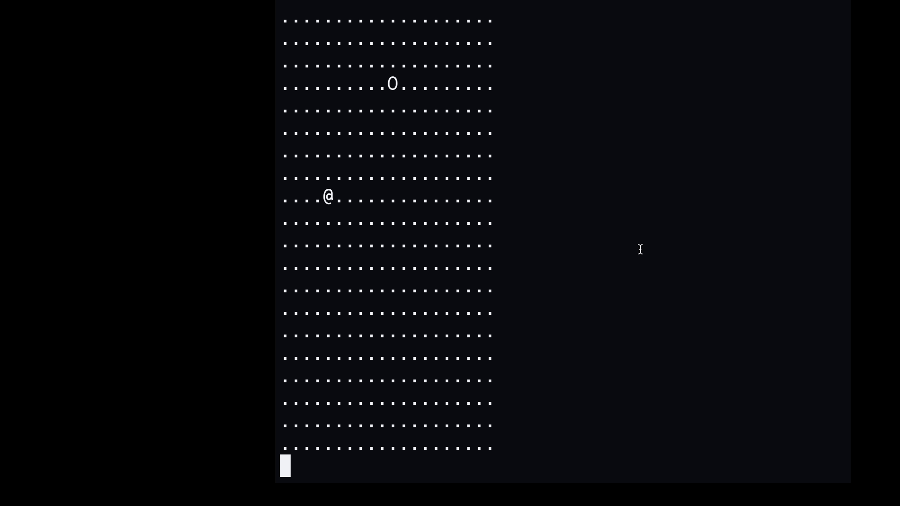

# Terminal Snake Game
Simple Snake game in C without fancy stuff.

## Why
This project emerged after watching Salvatore Sanfilippo a.k.a [@antirez](https://github.com/antirez) series on C programming ([youtube playlist](https://www.youtube.com/watch?v=HjXBXBgfKyk&list=PLrEMgOSrS_3cFJpM2gdw8EGFyRBZOyAKY&pp=0gcJCYYEOCosWNin)). It represents a return to fundamentals.
C isn't my primary language, and this project served as reconnection with systems programming after several years away from low-level development.

## How to Play
Ok, long story short my navigation keys are mapped to [n, e, i,o] keys on my keyobard, so to move the snake use: 
- `i`, move up (North)
- `e`, move down (South)
- `n`, Move left (West)
- `o`, Move right (East)

To quit/stop type `q`.

If you want to change them, just edit the `get_direction()` function

```c
int get_direction(char input){
	switch(input){
		case 'n': return WEST;
		case 'o': return EAST;
		case 'i': return NORTH;
		case 'e': return SOUTH;
	}
	return -1;
}
```

## Demo


## Technical Notes
1. I used termios for input handling after I found [this](https://stackoverflow.com/questions/1798511/how-to-avoid-pressing-enter-with-getchar-for-reading-a-single-character-only) post on StackOverflow.
2. In `logic.txt` you can find my "raw" thoughts as I was coding the game. 

